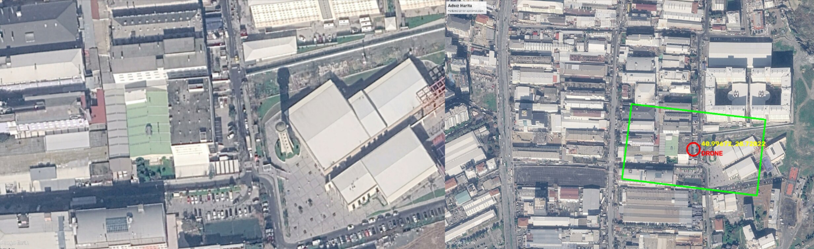

# GPS-Denied Visual Navigation

Estimating a drone's GPS position from a downward-facing camera image alone, by
matching it against a georeferenced satellite map. No GNSS signal required.

The use case is navigation under GPS denial or jamming — the drone still knows
where it is as long as it can see the ground and carries a map of the area.



## How It Works

1. **Feature detection** — SIFT keypoints and descriptors are extracted from both
   the drone frame and the satellite map. SIFT is used rather than ORB because
   the two images differ in scale, rotation and lighting, where binary
   descriptors degrade quickly.
2. **Matching** — descriptors are matched with a brute force matcher, then
   filtered with Lowe's ratio test: a match is kept only when the nearest
   neighbour is clearly closer than the second nearest.
3. **Homography** — RANSAC fits a homography from the drone frame to the
   satellite map, discarding the remaining outliers.
4. **Projection** — the center of the drone frame is projected through the
   homography to find its pixel position on the map.
5. **Pixel to GPS** — the pixel position is converted to latitude and longitude
   by bilinearly interpolating between the map's four known corner coordinates.

The script also draws the drone's field of view as a green quadrilateral on the
map, so the estimate can be checked visually rather than trusted blindly.

## Results

Tested on satellite imagery of Avcilar, Istanbul, against a drone frame captured
over the same area. The RANSAC stage retained 86% of the ratio-test matches as
inliers, and the resulting coordinates were verified against Google Earth.

## Usage

```bash
pip install -r requirements.txt
python src/locate_drone.py
```

Run it from the repository root — the image paths are relative.

The script prints the estimated coordinates and a Google Maps link, then opens
a window showing the drone frame next to the satellite map with the estimated
position marked.

## Using Your Own Map

Two things at the top of `src/locate_drone.py` need to change:

- `DRONE_IMAGE` and `SATELLITE_IMAGE` — paths to your images
- `SATELLITE_CORNERS` — the latitude and longitude of the four corners of your
  satellite image, read from Google Earth

The corner coordinates are what make the map georeferenced. Without them the
homography still works, but the output stays in pixels.

## Repository Structure

```
src/locate_drone.py    Full pipeline, from feature matching to GPS output
experiments/           Step-by-step versions written while building the pipeline
data/                  Sample drone and satellite imagery
```

The `experiments` folder traces how the pipeline was built: ORB keypoint
detection, then brute force matching, then the move to SIFT with the ratio test
and RANSAC. They are kept because the failure modes at each step are what
motivated the next one — ORB matching in particular breaks down badly once the
two views differ in rotation.

## Limitations

- The map is treated as a flat plane. Over hilly terrain the bilinear corner
  interpolation introduces error that grows with elevation change.
- Matching depends on visual similarity between the drone frame and the map.
  Seasonal change, snow cover, new construction or a large difference in
  altitude will reduce the inlier count.
- The satellite image is assumed to be north-up and roughly rectangular.
- Single-frame estimation only — there is no filtering or tracking across
  consecutive frames.

## Dependencies

- OpenCV (`opencv-python`) — includes SIFT since 4.4
- NumPy

## License

MIT — see [LICENSE](LICENSE).
